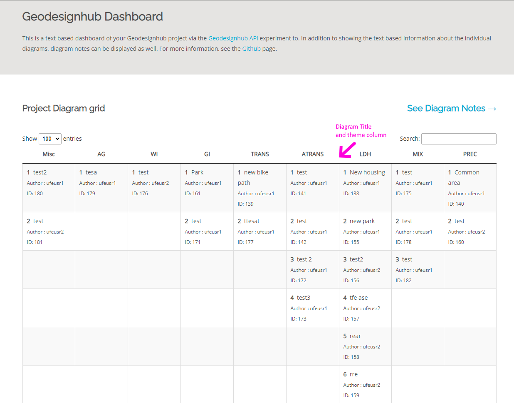
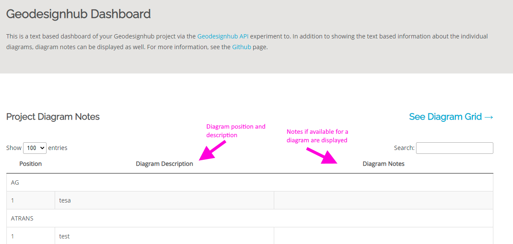

# Geodesignhub Dashboard

A text based version of data inside Geodesignhub using the [Geodesignhub API](http://www.geodesignsupport.com/section/api/). This project uses the API to get text descriptions of diagrams, systems, change teams and users and produces a text based version of the diagram data in the project.

## Screenshots

The diagrams grid in Geodesignhub is shown in text format along with the diagram id and description. In addition every diagram comes with a download link to take data out of Geodesignhub.

In addition the plugin can show and summarize diagram notes for all the diagrams grouped by themes for your project. 

